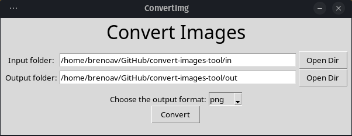

# Convert Images Tool

A simple tool for converting images formats quickly inside a directory to another.



# Dependencies

1. [tkinter package](https://docs.python.org/3/library/tkinter.html) (built in Python)
2. [Pillow package](https://pypi.org/project/Pillow/) (fork of PIL)

To install Pillow, you can use pip:

```console
pip install Pillow
```

# Running

- Run the following command in your terminal:

```console
$ python main.py
```

- You need to select the `input folder` and the `output folder`, if you type "out" will create a folder relative, i. e, will create a folder in the root project.

- Select a format option, available: `png`, `jpeg`, `webp`, and `tiff`
